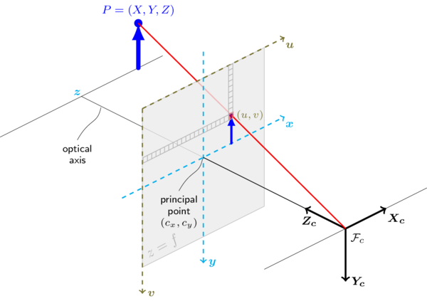
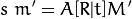
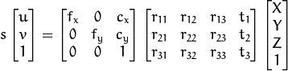

# Finding the Position and Rotation of a Chessboard Using Two Cameras

## Theory

When two cameras see the same point from different angles,
if we know the position, rotation and other parameters of each camera,
we can determine the coordinates of that point in the world.
The process of doing this is called triangulation.
When two cameras see a chessboard, we can run an algorithm
that finds all of the chessboard points (internal corners) in each image.
Using triangulation we can then find the position of each chessboard point in the world.
By looking at the position of all these points together,
we can calculate where the chessboard is in the world (position) and how it is rotated (rotation).

As mentioned, in order to use triangulation we have to know quite a lot about the two cameras.
A camera is defined by two groups of parameters: extrinsic parameters and intrinsic parameters.
Intrinsic (internal) parameters are defined by the physical construction of the camera.
These are the focal lengths, principal point (usually resolution divided by two)
and different distortion coefficients that describe how the camera distorts the image.
Finding these parameters is called internal calibration,
and unless we change one of these parameters (for example, change the image resolution or the zoom value)
they can be calculated once and used forever.
Extrinsic (external) parameters are the position and rotation of the camera.
The process of finding them is called external calibration,
and it has to be re-done every time we move or rotate the camera.

An important note about internal calibration: Even if we were to have a perfect camera,
we would still need to do internal calibration to find the focal lengths and principal point of the camera.
We need to know them in order to determine the relation between the camera’s natural units (pixels)
and the real world units (for example - millimeters).

### Internal Calibration

During internal calibration, we take many pictures of a chessboard (or another known object) from different angles.
The calibration algorithm observes the different points of the object in the taken pictures
in contrast to how they should be in the real world.
It can then determine the intrinsic parameters of the camera:

- Focal length at each axis (`fx` and `fy`).
  The longer the [focal length](http://www.nikonusa.com/en/learn-and-explore/article/g3cu6o2o/understanding-focal-length.html),
  the narrower the field of view and the higher the magnification (zoom).
- Principal point coordinates (`cx` and `cy`).
  Usually this is the middle point of the image,
  so `cx = resolution_x / 2` and `cy = resolution_y / 2`.
- Distortion coefficients according to the different
  [camera distortion](http://docs.opencv.org/trunk/d9/d0c/group__calib3d.html#details)
  models.
  We can use them later to correct the distortion in camera images.

After internal calibration the intrinsic parameters are saved for later use.

### External Calibration

If we want to track an object using cameras, we need to know where the cameras are in the world.
This problem too can be solved using a chessboard!
We can place the chessboard on the floor and decide how it defines the axes.
For example, the shorter edge may define the X axis, the longer edge define the Z axis
and the normal to surface of the chessboard define the Y axis.
To find the position of a camera in the world we need to take a picture of this chessboard,
and then calculate the position of the camera relatively to the chessboard (to the new axes).

The problem of finding the position of the chessboard relatively to the camera
can also be defined as finding the transformation (rotation and translation)
that was applied to a set of points before they were projected onto a 2D image.
This problem is known as the Perspective-n-Point (PnP) problem.
Image processing libraries like OpenCV include algorithms that solve it.

### The Pinhole Camera Model

Cameras can be described by different mathematical models,
the simplest of which is the [Pinhole Camera Model](https://en.wikipedia.org/wiki/pinhole_camera_model)
It describes how 3D points in the real world are mapped to 2D points on the final image.
Most camera lenses also introduce some amount of distortion that can be
expressed by more complex models that extend the pinhole camera model.



This is the pinhole camera formula that shows how a point in world space `(X, Y, Z)` is mapped to the image `(u, v)`:





- `X, Y, Z` are the coordinates of a point in world space.
- `u, v` are the coordinates in pixels of the point when projected onto the image.
- All `r` values are the elements of the camera rotation matrix.
- All `t` values are elements of the camera translation vector.
- Together, the 4x3 matrix on the right is called the rotation-translation matrix - `[R|T]`.
- `fx` and `fy` are the focal lengths, `cx` and `cy` are the coordinates of the principal point.
- The 3x3 matrix on the left is the camera matrix, sometimes labeled `A`.
- The product of the camera matrix and the rotation-translation matrix is often referred to as the projection matrix.
  It is all we need to find where on the image a world point would be.
- `s` is a number by which we divide the right side of the equation to receive `(u,v,1)`.
  We don’t care about it too much, and just get rid of it to find `u` and `v`.

The process of mapping a point from world space to the image space as described by this equation goes as follows:

1. We want to rotate the point according to the camera rotation values
   and translate (move) it according to the camera translation values.
   To do that using matrix multiplication we use a trick called
   [Homogeneous coordinates](http://robotics.stanford.edu/~birch/projective/node4.html).
   By adding a forth coordinate 1, the multiplication with the camera rotation-translation matrix
   both rotates and translates the points.
   It is important to note the the rotation and translation values in the matrix
   are not the rotation and translation of the camera,
   they are the rotation and translation that have to be applied to cancel
   the rotation and translation of the camera and move it to the origin.
   (i. e. the inverse of the rotation and translation of the camera).
2. We now have `(X', Y', Z')`, the coordinates of the point assuming the camera is at the origin.
   The following matrix multiplication does:

   ```
   X'' = X' * fx + cx
   Y'' = Y' * fy + cy
   Z'' = Z'
   ```

   The values `cx` and `cy` are added because we want the point `(0, 0, 1)`
   to be in the middle of the camera image `(cx, cy)` and not in the corner.
3. We now have the point `(X'', Y'', Z'')` that represents a ray from the origin to where the camera sees the point.
   We want to know where it intersects with the image plane that is `z=1`.
   To do that we divide the coordinates by some value `s` so that after the division the Z coordinate is 1
   (`s` is found on the left side of the equation).

Now that we have covered the concepts behind the pinhole camera it is a good time to take another look at the diagram above.
It may take some time to fully grasp the intuition behind the pinhole camera model, but it is very important you understand it.
The code we later present heavily relies on it.

More on the theory behind cameras:
- <https://prateekvjoshi.com/2014/05/31/understanding-camera-calibration/>
- <http://docs.opencv.org/trunk/d9/d0c/group__calib3d.html#details>
- <http://docs.opencv.org/3.1.0/d4/d94/tutorial_camera_calibration.html#gsc.tab=0>

## Our Code

All project files are at: <https://github.com/andrey-leshenko/chess_6dof>

We used:

- Two Sony [Playstation Eye](https://en.wikipedia.org/wiki/PlayStation_Eye) cameras.
- Asymmetric Chessboard Grids (These can be found in the OpenCV docs).
  They have to be asymmetric because you can’t be sure about the rotation of a symmetric chessboard grid.
- A computer running Ubuntu 16
- The CMake 3 build tool for compiling
- The OpenCV 3 computer vision library

### Why Linux?

We chose to use Linux because it has a built-in driver for the Sony Eye.
On Windows there is no built-in driver.
There are some [third party](https://codelaboratories.com/products/eye/driver/)
drivers that cost more the more cameras you want to use,
or [ports of the Linux driver](https://github.com/inspirit/PS3EYEDriver) done by some guy on Github.

We strongly advise against using an Ubuntu VM as your development environment.
When we tried doing this, we encountered extremely high video latency that caused a mysterious “selection timeout error”.
In case you have a hard time saying goodbye to Windows, you can dual boot your computer such that it supports both Windows and Linux.

### Required Software

#### Ubuntu
We used Ubuntu 16.04.1, which you can download from the official website.
The instructions that follow worked on this version of Ubuntu, but may not work on another distributions of Linux.

#### Cmake
Install the latest version of Cmake by running the following series of commands:

```bash
sudo apt-get install software-properties-common
sudo add-apt-repository ppa:george-edison55/cmake-3.x
sudo apt-get update
sudo apt-get upgrade
```

Make sure CMake is of version 3.2 or higher by running `cmake --version`.

#### OpenCV
Go to the home directory (or any other directory if you prefer)
and execute the script `install-opencv.sh` that is located at the root of the project files.
This script will install OpenCV 3 under the directory `./OpenCV`.
This script is taken from: <http://milq.github.io/install-opencv-ubuntu-debian/>
You can follow that tutorial to check that OpenCV is properly installed.

### Compiling the Code

This is the tree of our project:

```
├── calib_data
│   └── ps_eye.yaml
├── camutils
│   ├── camera_calibrate.cpp
│   ├── camera_framerate.cpp
│   ├── camera_latency.cpp
│   └── CMakeLists.txt
├── install-opencv.sh
└── track
    ├── CMakeLists.txt
    └── track.cpp
```

Both the camera utilities and the tracking code can be compiled in a similar way using CMake:

```bash
cd camutils # `cd track` if you want to compile the tracking code
mkdir build
cd build
cmake ..
make
```

We make a separate folder so the files CMake generates for itself will not pollute our code directory.
The resulting executable files will be placed in the respective `build` directory.
The next time you want to compile the code, navigate to that `build` directory and just execute the `make` command.

### Calibration Code

We wrote a program for internal camera calibration, found at `camutils/camera_calibrate.cpp`.
It allows you to take different pictures of the chessboard (from our experience, 20 should give a good result),
and save the resulting intrinsic parameters (the camera matrix and distortion coefficients) to a YAML/XML file.
The calibration files for our PlaystationEye camera are in `calib_data/ps_eye.yaml`.

The internal calibration can also be used to fix different kinds of lens distortions
by finding the different distortion coefficients and later distorting the image according to them.
There are different models for different kinds of distortion.
However, in our project we hadn’t noticed any noticeable distortions,
so we did not try to correct any of them in the tracking code.
Possibly this is due to correction being done at the hardware / driver level.

Our camera calibration code does the following tasks:

1. Let the user take pictures of a chessboard by pressing the spacebar and exit the program by pressing `q`.
2. In each of the taken pictures, search for a chessboard and show the result.
3. Calibrate the camera based on the chessboards that were found.
4. Write camera matrix and distortion coefficients to an XML/YAML file.
5. Apply the `cv::undistort` function to the captured images using the newly found distortion coefficients,
   and display the results to the user so he can asses the quality of the found coefficients.

After writing the calibration file, the program outputs the re-projection error
(calculated using the RMS method) which shows how closely the output parameters match the input images.
The re-projection error can assist in determining the quality of the calibration.

More on that:
- <http://stackoverflow.com/questions/5987285/what-is-an-acceptable-return-value-from-cvcalibratecamera>
- <http://stackoverflow.com/questions/11918315/does-a-smaller-reprojection-error-always-means-better-calibration>

### Tracking Code

The code for finding the position and rotation of a chessboard in real-time is found in `track/track.cpp`.

There codes does the following tasks:
1. Let the user see what each camera sees.
   The `j` and `k` keys switch between cameras and the space key moves the program to the next state.
2. Load the internal calibration from files specified during compilation.
3. Calculate the position and rotation of the cameras relative to a chessboard placed at the origin.
   This is done using the `cv::solvePnP` function.
   (External calibration)
4. Find the initial points of the chessboard.
   (just like we do later in the loop)
5. In a loop:
  1. Capture an image with both cameras.
  2. Find the chessboard in both camera images.
  3. Find the location of each point on the chessboard using `cv::triangulatePoints`,
     which determines the location of each point in world space based on its position in the two camera frames.
  4. Find the difference in translation between the current points and the initial points.
     (the translation of the centroid)
  5. Use the [Kabsch algorithm](http://nghiaho.com/?page_id=671) and SVD
     to find the difference in rotation between the current points and the initial points.
  6. Display the results using the glorious `cv::viz` module.

### Continuing from Here

Now that you understand the theory, it is a good time to take a look at the code.
As always, when it comes to learning something new, Google is your best friend.
